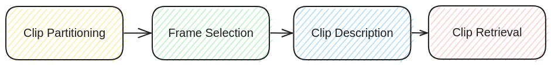
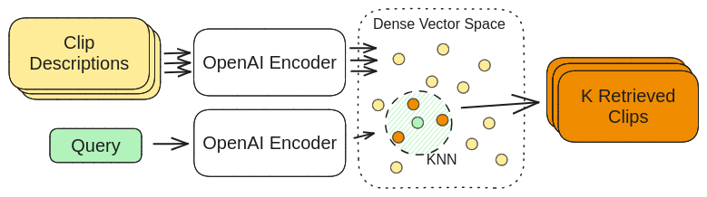

# VideoDescriptor: Video Understanding with LLMs

This repository contains a project I did that applied LLMs to video understanding.
At the time of writing, LLMs like LLaMA-2 had good multimodal image understanding, but hadn't been extended to video very successfully.
This project proposes a general pipeline to try to accomplish video retrieval in 4 steps:

1. Partition the video into individual clips.
2. From each clip, select a small subset of frames to represent the clip.
3. Using the selected frames, generate a textual description for each clip using an LLM.
4. Using the textual descriptions, retrieve clips relevant to a question or query.

Essentially, the system converts video into text, and then solves the analog text problem.
I created some custom video pre-processing as well, to segment long videos into atomic clips.

I also created a quick retreiver using the openAI embedding api:

---
This is a project for CSC2508 Advanced Data Systems, a course I took in Fall 2023 with prof Nick Koudas.
The original project prompt:

LLMs are multimodal and given images you can ask them to describe them in detail. This opens new
directions. Traditionally the vision community has developed video summarization algorithms (image
based) and video query answering techniques (image based as well). Can we perform the same tasks
with LLMs?
The idea is simple: get a large video, process it frame by frame via an LLM and get the textual
description of each frame (ask the LLM to describe the objects, their type, their relationships etc). Now
you have a large collection of documents (frame description and frame identifier). You can index them
and answer queries. You can summarise the document and identify corresponding frames to stitch a
video summary visually. Frame changes slowly so there is a lot of redundancy across frames which you
should filter out.

I don't think I've worked harder on a school project, so please give it a read if you can!

---
